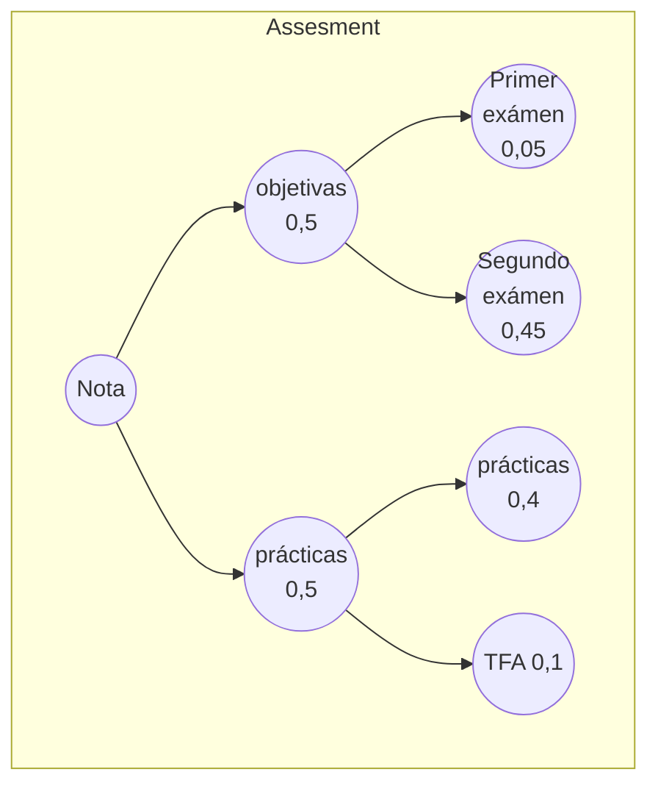

import { Callout } from 'nextra/components'
import { useRouter } from 'next/router';

const reload = router.reload();

## Horarios, Calendario académico y Tutorías

* [Horarios, Calendario académico y Tutorías](/schedules)

### Vías de Comunicación

* Usaremos la organización GitHub [ULL-ESIT-PL-2324](https://github.com/ULL-ESIT-PL-2324) y los Issues en GitHub en el repo de la correspondiente práctica. 
* Hacer una [incidencia en el repo de los apuntes de la asignatura](https://github.com/ULL-ESIT-PL-2324/pl-nextra/issues). Puede hacer click en el botón `Question? Give us feedback →` de la página de los apuntes de la asignatura en el panel de la derecha abajo.
* [Google chat and VideoConferences](https://mail.google.com/chat/u/1/#chat/welcome): Usen Google chat (institucional) 
* En la NavBar vaya al icono de la cámara para unirse al meet de clase 
* Reserve las tutorias por email a **crguezl@ull.edu.es**, **ilopezpl@ull.edu.es**

## Evaluación 

* Para la normativa de evaluación véase véase en la barra de navegación **Grado II > Normativa**
* Para la Guía Docente, véase en la barra de navegación **ULL > Guía Docente**
* Para el Cálculo de la Calificación el profesorado puede consultar la [configuración del calificador del Moodle](https://campusingenieriaytecnologia2324.ull.es/grade/edit/tree/index.php?id=2324090147)

* Superadas las partes: prácticas, tfa y las pruebas objetivas  la nota es la media ponderada de las partes:
  $$0,4 \times practicas + 0,5 \times objetivas + 0,1 \times tfa$$

### Corrección de las Prácticas

Véase la sección [Procedimiento de corrección de las Prácticas](/topics/introduction-to-pl/correccion-de-practicas)

### Organigrama de Renuncia

Incluye la nueva versión del reglamento aprobado en Junio de 2023

En el curso 23/24 "**El alumnado podrá optar a la evaluación única comunicándolo al coordinador a través del procedimiento habilitado en el aula virtual de la misma antes del último día de docencia del cuatrimestre**".
 
* En PL todas las prácticas suman el 40% de la nota final
* El TFA suma el 10% de la nota final
* La prueba objetiva final es el 40% de la nota final
* La prueba objetiva parcial es el 10% de la nota final
* El porcentaje del 40% puede incrementarse en la Guía Docente de hasta un 60% 

## Tareas Iniciales

### Rellenar Cuestionario 

Rellena el Cuestionario 
[Relación GitHub-AluXXXX](https://campusingenieriaytecnologia2324.ull.es/mod/assign/view.php?id=1984)  

* Puedes poner un correo distinto del de la ULL si lo prefieres
* Pon los usuarios GitHub (si tienes mas de uno) con los que vayas a hacer los commits en las prácticas de la asignatura

### Práctica: GitHub Campus Expert

* [Práctica Opcional: GitHub Campus Expert (github-campus-expert)](/labs/github-campus-expert)

### Práctica: GitHub Project Board

* [GitHub Project Board: github-project-board](/labs/github-project-board)

### Práctica: Visual Studio Code

* [Visual Studio Code](/labs/visual-studio-code)

### Práctica: IAAS

* [IAAS](/labs/iaas)

## La Bibliografía

La mayor parte de los [libros](/references) están accesible via el [PuntoQ de la BULL](/recursos/#bull).

Usaremos bastante estos libros:

* [Eloquent JS 3rd Edition](https://eloquentjavascript.net/)
* [The Modern JavaScript Tutorial. https://javascript.info/](https://javascript.info/)

