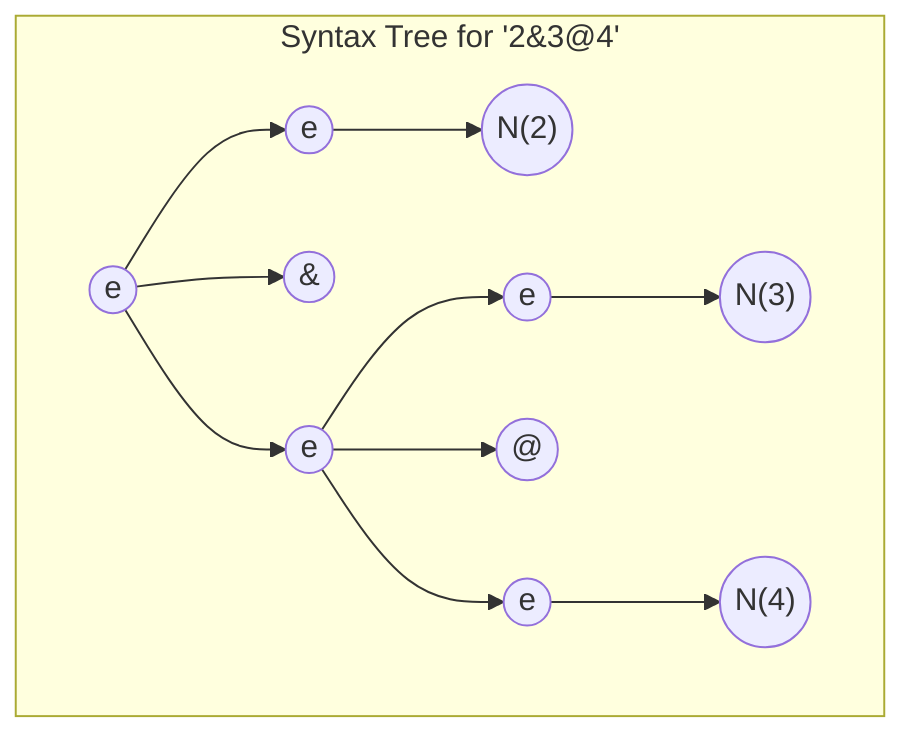
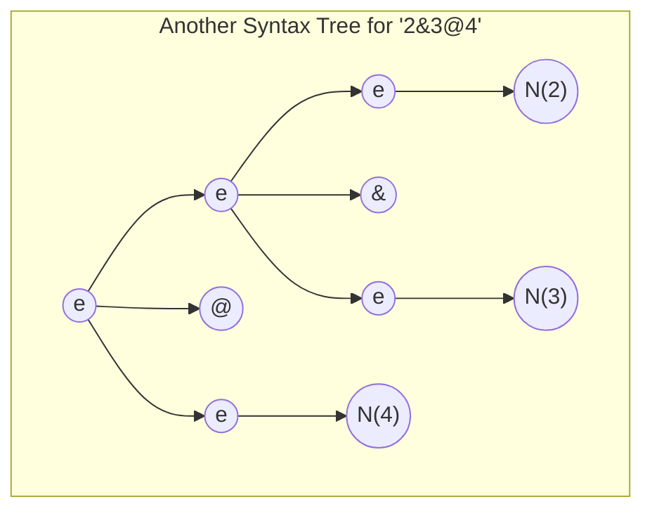

# Hello Compilers

Antes de emprender esta práctica, asegúrese de entender los dos ejemplos de parser generator en el repo [crguezl/hello-jison](https://github.com/crguezl/hello-jison). Los ejemplos incluyen 
1. Un evaluador de expresiones aritméticas de restas (ficheros `minus-ast.jison`, `minus.l` y `use-ast.js`) y 
2. Un traductor a JS de expresiones aritméticas de restas (ficheros `minus-ast.jison`, `ast-build.js`, `minus.l` y `use-ast.js`)


## Two new operators & and @

Let us consider a notation of arithmetic in which the `@` and `&` symbols on numbers are defined as the `max` and `min` operations. Thus, with this notation

$$12 @ 7=\max\{12,7\}=12$$ 

and

$$12 \& 7=\min\{12,7\}=7$$

Extienda  [el traductor de la calculadora](/practicas/arith2js.html) para que admita estas expresiones aritméticas y las traduzca a un programa JavaScript que las compute y las imprima.

**Supondremos que el mínimo `&` tiene mas prioridad que el máximo `@`**. Por ejemplo, la entrada $234 @ 325 \&  57$ podría ser traducida al siguiente código JS:

```js
console.log(max(234, min(325,57)))
```

Compared to the other tokens, give  a low priority to the `@` and `&` operators so that 
an expression `4!@3**2` should be interpreted as `(4!)@(3**2)` and produces a JS code as `max(factorial("4"), pow("3", "2")))`.

Como en la práctica anterior extienda el programa [Jison](/temas/syntax-analysis/analisis-LR/#introduccion-al-analisis-lr) hecho en la práctica anterior con estas dos operaciones para que produzca un AST compatible Espree conteniendo el correspondiente código JS. A continuación utilice [escodegen.generate(ast)](https://github.com/estools/escodegen) para generar el código JS


## Dealing with Ambiguity

For the `&` and `@` operators you can extend the initial incomplete grammar in the assignment repo this way:

```js
%{
const { buildLiteral, buildRoot, buildMin } = require('./ast-build');
%}

%%
es: e 
;

e: 
    e '@' e  
  | e '&' e  
  | N        
  | '(' e ')'
;
``` 

The problem with this grammar is that it is ambiguous. Expressions like `2&3@4`  have more than one concrete syntax tree.

On one side:



that will lead to the interpretation `2&(3@4)`; but we have also this other syntax tree:


that leads to the interpretation `(2&3)@4`.

Read the teacher notes on [precedence and associativity](https://crguezl.github.io/pl-html/node57.html) and see the examples in the [Repo crguezl/jison-prec](https://github.com/crguezl/jison-prec).

To break the ambiguity you  have to set that the precedence of the  token `&` is higher that the one of the token `@`. 

You have also to fix the ambiguity for phrases like `2&3&4` and `3@4@5` favouring a left associativity interpretation, i.e. preferring `(2&3)&4` to `2&(3&4)` and `(3@4)@5` to `3@(4@5)`.

### Breaking Ambiguity in Jison/Eyapp/Yacc/Bison et al. using token precedence 

These is a simplified version of the rules to resolve conflicts and ambiguities in a Yacc-like parser generator:

::: danger Precedence Rules
1. La precedencia de los tokens se hace en la cabecera del programa Jison; esto es: antes del primer `%%` usando la sintáxis `%left token ...` , `%right token ...` o `%nonassoc token ...`
2. La precedencia de una regla de producción $A \rightarrow \alpha$ es la precedencia del último token que aparece en la parte derecha $\alpha$ de la regla
   * Por ejemplo la precedencia de $e \rightarrow e @ e$ será la precedencia que le demos al token $@$
3. Cuando el parser detecta un conflicto y ve que hay dos posibles vias de continuar la construcción del árbol: Una que indica que quizá se aplicó la regla $A \rightarrow \alpha$ y otra que indica que quizá se pueda seguir leyendo el token $t$ a la entrada, 
   1. El parser compara las precedencias del token y de la regla y se queda con el de mas prioridad. 
   2. Si es el token quien tiene mayor prioridad avanzará en la lectura desplazando el token $t$ y buscando nuevos símbolos (se dice que hace un *shift*; en este caso probablemente el AST se "hundirá" a derechas) y 
   3. Si es la regla completará el subárbol parcial $\overset{A}{\overset{\triangle}{\alpha}}$ y continuará en su construcción del árbol (se dice que hace un *reduce* y en este caso el árbol construido estará más hundido a izquierdas)
4. Los tokens declarados en la misma línea mediante una declaración `%left` o `%right` 
tienen igual precedencia e igual asociatividad. 
3. La precedencia es mayor cuanto mas abajo su posición en el texto
:::

Así, en nuestro ejemplo deberíamos poner:

```
... 

%left @
%left &
%%
es: e 
;

...
```

## Challenge: Complex Numbers

Extend the regular expressions in the lexical analyzer to cover both floating point real numbers like `2.53e-2` and floating point imaginary numbers like `2.9e-5i` or `-i`.

The [complex.js](https://github.com/infusion/Complex.js) library provides a constructor `Complex` and methods `mul`, `add`, `sub`, `div`, etc.  that can be used this way:

```js
  let Complex = require('complex.js'); 
  let c = Complex({ re: 1.0e1, im: 8}); // Same: let c = Complex("1.0e1 + 8i");
  console.log(c); // { re: 10, im: 8 }
  console.log(c.mul({re: 2, im: 2}).div(2).sub(3, 2)); // { re: -1, im: 16 }
  console.log(c.add({re: 3, im: 9})); // { re: 13, im: 17 }  
```

Write the code inserting the support functions and the require to [complex.js](https://github.com/infusion/Complex.js) lib in the `preamble` that is concatenated to the generated code.

## Redefining the minimum and maximum operators for complex numbers

When comparing Complex Number expressions, compare their modules. For example, the expression `2+3i<4+5i` can be interpreted as 

```js
Complex("2").add("3i").abs() < Complex("4").add("5i").abs()
``` 

For real floating point numbers, this leads to the comparison of absolute values. For instance `2.3<-4.5` should be 

```js 
Complex("2.3").abs() < Complex("4.5").neg().abs()
``` 

which is `true`.

Since `&` and `@` have a lower priority than `+` and `-`, an expression like `4+5i&3-2i` should be interpreted as `(4+5i)&(3-2i)`.

## Redefining the factorial function

To keep compatibility with the calculator in the previous lab, you can extend the complex class with a factorial method like this: 

```js
#!/usr/bin/env node
const Complex = require("complex.js");

Complex.prototype.factorial = function() {
  if (this.im !== 0) throw new Error(`Imaginary part must be zero. Instead is ${this.im}`);
  let n = this.re;
  if (!Number.isInteger(n)) throw new Error(`Not an Integer number ${n}`);
  if ( n < 0) throw new Error(`Factorial of negative number ${n}`);
  let result = Complex(1);
  if (n === 0) return result;
  for (let i = 1; i <= n; i++) {
    result = result.mul(i);
  }
  return Complex({re: result.re, im: this.im});
};

console.log(Complex(process.argv[2]).factorial());
```

Here are several executions of the former example:

```
➜  complex-lib ./factorial.js "3"
{ re: 6, im: 0 }
➜  complex-lib ./factorial.js "3+2i"
Error: Imaginary part must be zero. Instead is 2
➜  complex-lib ./factorial.js "-3+0i"
Error: Factorial of negative number -3
➜  complex-lib ./factorial.js "-3.2+0i"
Error: Not an Integer number -3.2
```

The new version of the `factorial` function has to be added in the `preamble` of the generated code.


## The translation scheme

Thus your calc translator must be able to generate code for expressions like

```
2!+3**2i-4i
```

that using the complex library augmented with our `factorial` can be ultimately evaluated as:

```js
Complex(2).factorial().add(Complex(3).pow("2i")).sub(Complex("4i"))
```

Using auxiliary proxy functions like `sub`, `add`, `pow`, etc. 
`2!+3**2i-4i` can be translated as:

```js
sub(add(factorial("2"), pow("3", "2i")), "4i")
```

which simplifies the AST and thus the translation.

An expression `4+5i&3-2i` should be interpreted as `(4+5i)&(3-2i)` and can produce a JS code as `min(add("4", "5i"), (sub("3", "2i")))`.


## Pruebas

Añada [pruebas](/temas/introduccion-a-javascript/pruebas) usando [Mocha y Chai](/temas/introduccion-a-javascript/mocha) o [Jest](/temas/introduccion-a-javascript/jest)

!!!include(temas/introduccion-a-javascript/mocking-stubbing.md)!!!

## Covering 

You can use  [nyc](https://www.npmjs.com/package/nyc) to do the covering of your mocha tests.
See the notes in [covering](/temas/introduccion-a-javascript/covering). 

Activate the GitHub pages of your repo (use the default branch and the `docs` folder) and be sure to include your covering report in the `docs` folder.

## Continuous Integration

Añada Integración contínua usando GitHub actions.
Lea la sección [GitHub Actions](/temas/introduccion-a-javascript/github-actions) de los apuntes.


## References

### Essentials for this lab

* See the examples in the repo [crguezl/hello-jison](https://github.com/crguezl/hello-jison)
* [https://astexplorer.net](https://astexplorer.net)
* [Tipos de Nodos del AST](/temas/introduccion-a-pl/espree-visitorkeys) y nombres de las propiedades de los hijos
* [Escodegen repo en GitHub](https://github.com/estools/escodegen)
  - [Escodegen API Doc](https://github.com/estools/escodegen/wiki/API)
* [Jison Documentation](https://gerhobbelt.github.io/jison/docs//)

### Jison and Syntax Analysis

* [Análisis Sintáctico Ascendente en JavaScript](https://crguezl.github.io/pl-html/node43.html)
* [Jison](/temas/syntax-analysis/analisis-LR/#introduccion-al-analisis-lr)
* [Mi primer proyecto utilizando Jison](https://ericknavarro.io/2019/07/21/17-Mi-primer-proyecto-utilizando-Jison-Linux/) por Erick Navarro
* [Folder jison/examples from the Jison distribution](https://github.com/zaach/jison/tree/master/examples)
* [Jison Debugger](https://nolanlawson.github.io/jison-debugger/)
* [Precedencia y Asociatividad](https://crguezl.github.io/pl-html/node57.html)
    - [Repo de ejemplo crguezl/jison-prec](https://github.com/crguezl/jison-prec)
* [Construcción de las Tablas para el Análisis SLR](https://crguezl.github.io/pl-html/node49.html)
* [Algoritmo de Análisis LR (yacc/bison/jison)](https://crguezl.github.io/pl-html/node55.html)
* [Repo ULL-ESIT-PL-1718/jison-aSb](https://github.com/ULL-ESIT-PL-1718/jison-aSb)
* [Repo ULL-ESIT-PL-1718/ull-etsii-grado-pl-jisoncalc](https://github.com/ULL-ESIT-PL-1718/ull-etsii-grado-pl-jisoncalc)
* <a href="https://medium.com/basecs/leveling-up-ones-parsing-game-with-asts-d7a6fc2400ff" rel="nofollow">Leveling Up One’s Parsing Game With ASTs</a> by <a href="https://twitter.com/vaidehijoshi" rel="nofollow">Vaidehi Joshi</a> <em> 👍</em>


### Have a look

* [JAVASCRIPT AST VISUALIZER](https://resources.jointjs.com/demos/javascript-ast) jointjs demos
* [Espree](https://github.com/eslint/espree)
  * [Options for parse and tokenize methods](https://github.com/eslint/espree#options)
* [Lunar Arithmetic](https://en.wikipedia.org/wiki/Lunar_arithmetic)

