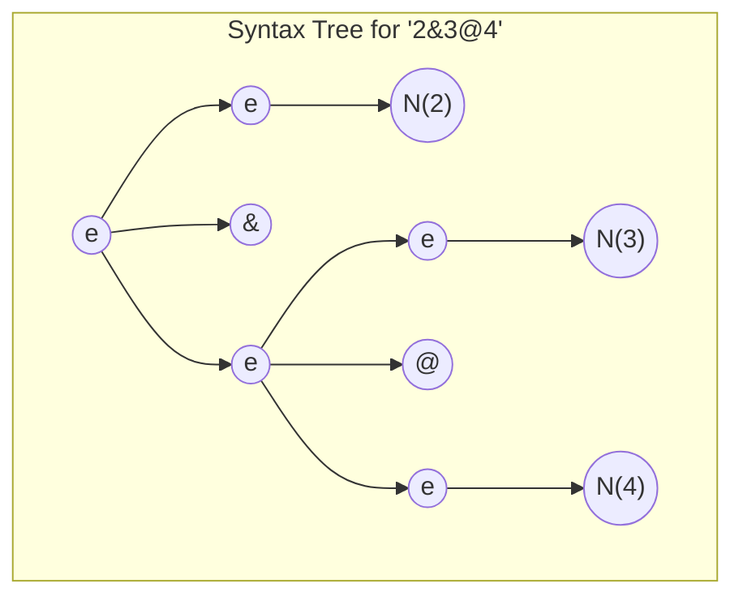
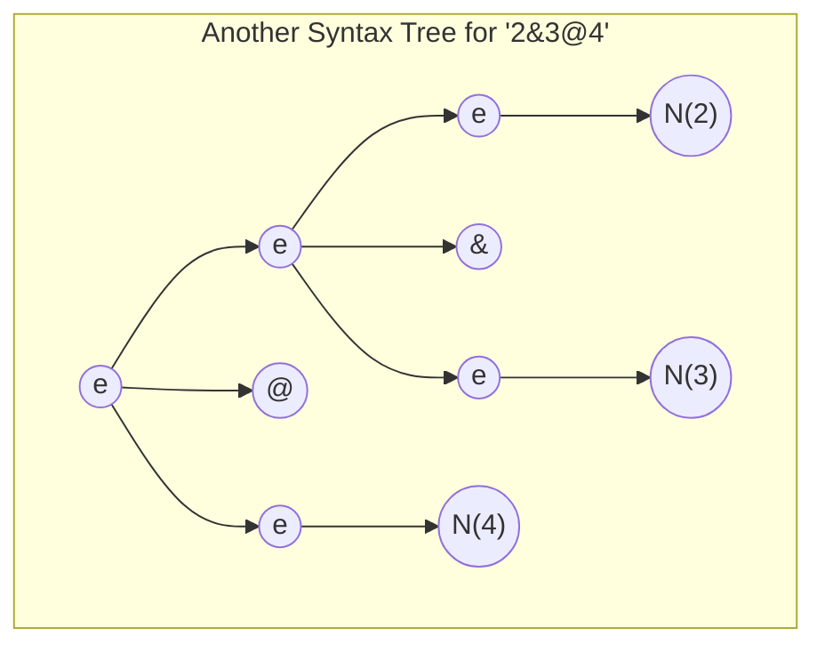

Antes de emprender esta práctica, asegúrese de entender los ejemplos de parser generator en el repo [ULL-ESIT-PL/hello-jison](https://github.com/ULL-ESIT-PL/hello-jison/tree/master/ast). 


## Two new operators & and @

Let us consider a notation of arithmetic in which the `@` and `&` symbols on numbers are defined as the `max` and `min` operations. Thus, with this notation

$$12 @ 7=\max\{12,7\}=12$$ 

and

$$12 \& 7=\min\{12,7\}=7$$

Extienda  [el traductor de la calculadora](https://github.com/ULL-ESIT-PL/hello-jison/blob/master/ast/minus-ast.jison) para que admita estas expresiones aritméticas y las traduzca a un programa JavaScript que las compute y las imprima.

**Supondremos que el mínimo `&` tiene mas prioridad que el máximo `@`**. Por ejemplo, la entrada $234 @ 325 \&  57$ podría ser traducida al siguiente código JS:

```js copy
console.log(max(234, min(325,57)))
```

Compared to the other tokens, give  a low priority to the `@` and `&` operators so that 
an expression `4!@3**2` should be interpreted as `(4!)@(3**2)` and produces a JS code as `max(factorial("4"), pow("3", "2")))`.

Since `&` and `@` have a lower priority than `+` and `-`, an expression like `4+5i&3-2i` should be interpreted as `(4+5i)&(3-2i)`.

Extienda el programa [Jison](/topics/syntax-analysis/analisis-LR/#introduccion-al-analisis-lr) hecho en la práctica anterior con estas dos operaciones para que produzca un AST compatible Espree conteniendo el correspondiente código JS. A continuación utilice [escodegen.generate(ast)](https://github.com/estools/escodegen) para generar el código JS


## Dealing with Ambiguity

For the `&` and `@` operators you can extend the initial incomplete grammar in the assignment repo this way:

```js
%{
const { buildLiteral, buildRoot, buildMin } = require('./ast-build');
%}

%%
es: e 
;

e: 
    e '@' e  
  | e '&' e  
  | N        
  | '(' e ')'
;
``` 

The problem with this grammar is that it is ambiguous. Expressions like `2&3@4`  have more than one concrete syntax tree.

On one side:



that will lead to the interpretation `2&(3@4)`; but we have also this other syntax tree:


that leads to the interpretation `(2&3)@4`.

To break the ambiguity you  have to set that the precedence of the  token `&` is higher that the one of the token `@`. 

You have also to fix the ambiguity for phrases like `2&3&4` and `3@4@5` favouring a left associativity interpretation, i.e. preferring `(2&3)&4` to `2&(3&4)` and `(3@4)@5` to `3@(4@5)`.

An expression `4+5i&3-2i` should be interpreted as `(4+5i)&(3-2i)` and can produce a JS code as `min(add("4", "5i"), (sub("3", "2i")))`.


## Breaking Ambiguity in Jison

import Conflicts from "@/pages/topics/syntax-analysis/conflicts.mdx"

To deal with issues of ambiguity in grammar,
you can consult

* [Conflict Solving in Yacc](/topics/syntax-analysis/conflicts)
* the [Precedence and Associativity](https://crguezl.github.io/pl-html/node57.html) section of the old PL notes
* See the examples in the [Repo ULL-ESIT-PL/jison-prec](https://github.com/ULL-ESIT-PL/jison-prec).

<Conflicts />

## Complex Numbers

Extend the regular expressions in the lexical analyzer to cover both floating point real numbers like `2.53e-2` and floating point imaginary numbers like `2.9e-5i` or `-i`.

The [complex.js](https://github.com/infusion/Complex.js) library provides a constructor `Complex` and methods `mul`, `add`, `sub`, `div`, etc.  that can be used this way:

```js
  let Complex = require('complex.js'); 
  let c = Complex({ re: 1.0e1, im: 8}); // Same: let c = Complex("1.0e1 + 8i");
  console.log(c); // { re: 10, im: 8 }
  console.log(c.mul({re: 2, im: 2}).div(2).sub(3, 2)); // { re: -1, im: 16 }
  console.log(c.add({re: 3, im: 9})); // { re: 13, im: 17 }  
```

Write the code inserting the support functions and the require to [complex.js](https://github.com/infusion/Complex.js) lib in the `preamble` that is concatenated to the generated code.

## Redefining the minimum and maximum operators

Use [lexicographical order](https://en.wikipedia.org/wiki/Lexicographic_order) to compare Complex numbers:

${\displaystyle a+bi\leq a^{\prime }+b^{\prime }i{\text{ if and only if }}a<a^{\prime }{\text{ or }}\left(a=a^{\prime }{\text{ and }}b\leq b^{\prime }\right),}$

## Redefining the factorial function

To keep compatibility with the calculator in the previous lab, you can extend the complex class with a factorial method like this: 

```js copy filename="hello-compilers/complex-lib/factorial.js"
#!/usr/bin/env node
const Complex = require("complex.js");

Complex.prototype.factorial = function() {
  if (this.im !== 0) throw new Error(`Imaginary part must be zero. Instead is ${this.im}`);
  let n = this.re;
  if (!Number.isInteger(n)) throw new Error(`Not an Integer number ${n}`);
  if ( n < 0) throw new Error(`Factorial of negative number ${n}`);
  let result = Complex(1);
  if (n === 0) return result;
  for (let i = 1; i <= n; i++) {
    result = result.mul(i);
  }
  return Complex({re: result.re, im: this.im});
};

console.log(Complex(process.argv[2]).factorial());
```

Here are several executions of the former example:

``` filename="hello-compilers/complex-lib/factorial.js"
➜  complex-lib ./factorial.js "3"
{ re: 6, im: 0 }
➜  complex-lib ./factorial.js "3+2i"
Error: Imaginary part must be zero. Instead is 2
➜  complex-lib ./factorial.js "-3+0i"
Error: Factorial of negative number -3
➜  complex-lib ./factorial.js "-3.2+0i"
Error: Not an Integer number -3.2
```

The new version of the `factorial` function has to be added in the `preamble` of the generated code.


## The translation scheme

Thus your calc translator must be able to generate code for expressions like

```
2!+3**2i-4i
```

that using the complex library augmented with our `factorial` can be ultimately evaluated as:

```js copy
Complex(2).factorial().add(Complex(3).pow("2i")).sub(Complex("4i"))
```

Using auxiliary proxy functions like `sub`, `add`, `pow`, etc. 
`2!+3**2i-4i` can be translated as:

```js
sub(add(factorial("2"), pow("3", "2i")), "4i")
```

which simplifies the AST and thus the translation.


## Tests

Añada [pruebas](/topics/introduction-to-javascript/pruebas) usando [Mocha y Chai](/topics/introduction-to-javascript/mocha) o [Jest](/topics/introduction-to-javascript/jest)

import MockingStubbing from "@/pages/topics/introduction-to-javascript/mocking-stubbing.mdx"

<MockingStubbing />

## Covering 

You can use  [nyc](https://www.npmjs.com/package/nyc) to do the covering of your mocha tests.
See the notes in [covering](/topics/introduction-to-javascript/covering). 

Activate the GitHub pages of your repo (go to settings and use the default branch and the `docs` folder) and be sure to include your covering report in the `docs` folder. Add to your `package.json` a script to run the tests and leave the report in the `docs` folder.

## Continuous Integration

Esta tarea tiene asociada una GitHub Action [education/autograding](https://github.com/education/autograding) para ejecutar los tests proveidos por el profesor.
Añada tests y compruebe en las  GitHub actions de su repo el estado de las pruebas.
Lea la sección [GitHub Actions](/topics/introduction-to-javascript/github-actions) de los apuntes.

## Rubric

import Rubric from '@/components/rubric'

<Rubric rubric={frontmatter().rubrica} />

## {frontmatter().key} Repos

import { frontmatter} from '@/src/frontmatter'
import ReposForLab from '@/components/repos-for-lab'

<ReposForLab lab={frontmatter().key} />


## References

### Essentials for this lab

* See the examples in the repo [ULL-ESIT-PL/hello-jison](https://github.com/ULL-ESIT-PL/hello-jison)
* [https://astexplorer.net](https://astexplorer.net)
* [Tipos de Nodos del AST](/topics/introduction-to-pl/espree-visitorkeys) y nombres de las propiedades de los hijos
* [Escodegen repo en GitHub](https://github.com/estools/escodegen)
  - [Escodegen API Doc](https://github.com/estools/escodegen/wiki/API)
* [Jison Documentation](https://gerhobbelt.github.io/jison/docs//)

### Jison and Syntax Analysis

* [Análisis Sintáctico Ascendente en JavaScript](https://crguezl.github.io/pl-html/node43.html)
* [Jison](/topics/syntax-analysis/analisis-LR/#introduccion-al-analisis-lr)
* [Mi primer proyecto utilizando Jison](https://ericknavarro.io/2019/07/21/17-Mi-primer-proyecto-utilizando-Jison-Linux/) por Erick Navarro
* [Folder jison/examples from the Jison distribution](https://github.com/zaach/jison/tree/master/examples)
* [Jison Debugger](https://nolanlawson.github.io/jison-debugger/)
* [Precedencia y Asociatividad](https://crguezl.github.io/pl-html/node57.html)
    - [Repo de ejemplo ULL-ESIT-PL/jison-prec](https://github.com/ULL-ESIT-PL/jison-prec)
* [Construcción de las Tablas para el Análisis SLR](https://crguezl.github.io/pl-html/node49.html)
* [Algoritmo de Análisis LR (yacc/bison/jison)](https://crguezl.github.io/pl-html/node55.html)
* [Repo ULL-ESIT-PL-1718/jison-aSb](https://github.com/ULL-ESIT-PL-1718/jison-aSb)
* [Repo ULL-ESIT-PL-1718/ull-etsii-grado-pl-jisoncalc](https://github.com/ULL-ESIT-PL-1718/ull-etsii-grado-pl-jisoncalc)
* <a href="https://medium.com/basecs/leveling-up-ones-parsing-game-with-asts-d7a6fc2400ff" rel="nofollow">Leveling Up One’s Parsing Game With ASTs</a> by <a href="https://twitter.com/vaidehijoshi" rel="nofollow">Vaidehi Joshi</a> <em> 👍</em>


### Have a look

* [JAVASCRIPT AST VISUALIZER](https://resources.jointjs.com/demos/javascript-ast) jointjs demos
* [Espree](https://github.com/eslint/espree)
  * [Options for parse and tokenize methods](https://github.com/eslint/espree#options)
* [Lunar Arithmetic](https://en.wikipedia.org/wiki/Lunar_arithmetic)

