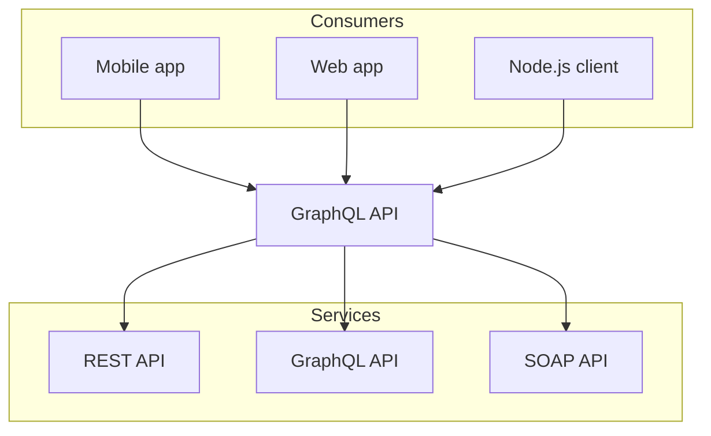

# Nextra MDX examples

```js
import { Callout, Steps } from 'nextra/components'

export const  author = 'John Doe'
``` 

import { Callout, Steps } from 'nextra/components'

export const  author = 'John Doe'
 
## References

* [Nextra 2 – Next.js Static Site Generator](https://the-guild.dev/blog/nextra-2). Jan 24th 2023. Dimitri Postolov and Shu Ding

## JS substitution

```
The author is **{ author }**
```

The author is **{ author }**

## Satori

Satori (悟り) is a Japanese Buddhist term for awakening, "comprehension; understanding".

## Mermaid 



## Callout

<Callout>
  More about translators can be found
  [here](/labs/arith2js).
</Callout>

## Steps

### Create Manually

Nextra works like a Next.js plugin, and it accepts a theme config (layout) to
render the page. To start: [^3]

<Steps>
### Install Next.js, Nextra and React [^1]

```sh npm2yarn
npm i react react-dom next nextra
```

### Install the docs theme [^2]

```sh npm2yarn
npm i nextra-theme-docs
```

### Create the following Next.js config and theme config under the root directory

```js filename="next.config.js"
const withNextra = require('nextra')({
  theme: 'nextra-theme-blog',
  themeConfig: './theme.config.js'
  // optional: add `staticImage: true` to enable Nextra's auto image import
})
module.exports = withNextra()
```

### Create a `theme.config.js` file for the docs theme

```js filename="theme.config.js"
/**
 * @type {import('nextra-theme-docs').DocsThemeConfig}
 */
export default {
  project: {
    link: 'https://github.com/shuding/nextra' // GitHub link in the navbar
  },
  docsRepositoryBase: 'https://github.com/shuding/nextra/blob/master', // base URL for the docs repository
  getNextSeoProps: () => ({ titleTemplate: '%s – Nextra' }),
  navigation: true,
  darkMode: true,
  footer: {
    text: `MIT ${new Date().getFullYear()} © Shu Ding.`
  },
  editLink: {
    text: 'Edit this page on GitHub'
  },
  logo: (
    <>
      <svg>...</svg>
      <span>Next.js Static Site Generator</span>
    </>
  ),
  head: (
    <>
      <meta name="viewport" content="width=device-width, initial-scale=1.0" />
      <meta name="description" content="Nextra: the next docs builder" />
      <meta name="og:title" content="Nextra: the next docs builder" />
    </>
  ),
  primaryHue: {
    dark: 204,
    light: 212
  }
}
```

<Callout>
  More configuration options for the docs theme can be found
  [here](/themes/docs/configuration).
</Callout>

### You are good to go! Run `next dev` to start

</Steps>

---

<span id="sidebar-and-anchor-links" />
<Callout>
  Any `.md` or `.mdx` file will turn into a doc page and be displayed in
  sidebar. You can also create a `meta.json` file to customize the page order
  and title. <br /> Check the source code: https://github.com/shuding/nextra for
  more information.
</Callout>

<Callout>
You can also use [`<style jsx>`](https://nextjs.org/docs/basic-features/built-in-css-support#css-in-js) to style elements inside `theme.config.js`.
</Callout>

[^1]: Install Next.js, Nextra and React.
[^2]: Install the docs theme.
[^3]: To start.